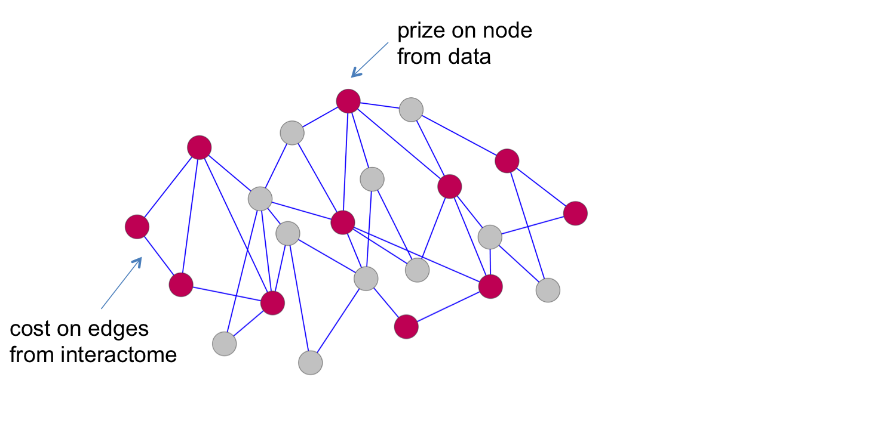
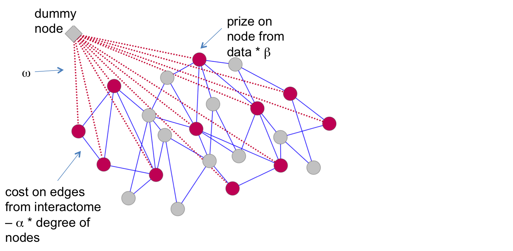

# OmicsIntegrator2

Omics Integrator is a package designed to integrate proteomic data, gene expression data and/or epigenetic data using a protein-protein interaction network. It identifies high-confidence, relevant subnetworks from the underlying interactome. It is comprised of two modules, [Garnet](https://github.com/fraenkel-lab/GarNet) and Forest. This repository holds the code for Forest in version 2 of Omics Integrator.

Forest first maps your high-throughput data onto the network. Proteins in the network are 'nodes' connected by edges representing physical interactions of two protein nodes. You should assign protein nodes prizes from your high-throughput data, i.e. the prize could be the log fold change of that protein in your system. The edges are assigned costs, often proportional to the confidence in that interaction.

Forest then adds a 'dummy node' to the network with edges to all of the nodes you've assigned prizes, called terminals. There are several parameters you can change in Forest. Omega, the cost of the edges between the root dummy node and the terminals, determines the number of pathways in the final solution. Beta, the relative weighting between node prizes and edge costs, determines the size of the final solution. And alpha adds a penalty to edges based on the degrees of the two nodes that the edge connects. This keeps the network from being biased towards "hub nodes", often highly studied and promiscuous proteins that may not be specific to your system.

Finally, Forest uses the Prize-Collecting Steiner Forest algorithm to whittle the large interactome down to relevant sub-networks, or pathways. These pathways are likely places to look for important cellular functions altered in your system. They will include some, but not all, of your terminals. They may also include "Steiner nodes", nodes that you did not assign a prize to, but that the algorithm is predicting are important to the pathways altered in your system.

With the output of these sub-networks, Omics Integrator allows researchers to go from huge, often contradictory lists of genes, proteins, and metabolites from multiple -omics data sources to a few important cellular pathways to focus on in follow-up studies of their system.

Reference:
--------------------
[Network-Based Interpretation of Diverse High-Throughput Datasets through the Omics Integrator Software Package](http://dx.doi.org/10.1371/journal.pcbi.1004879)
Tuncbag N\*, Gosline SJC\*, Kedaigle A, Soltis AR, Gitter A, Fraenkel E. *PLoS Comput Biol* 12(4): e1004879. doi:10.1371/journal.pcbi.1004879.

Contact: Amanda Kedaigle [mandyjoy@mit.edu]

Copyright (c) 2017 Massachusetts Institute of Technology
All rights reserved.

